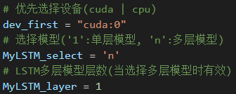
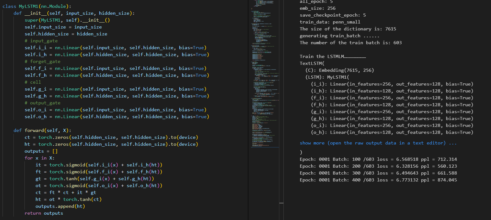
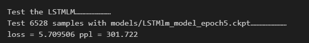
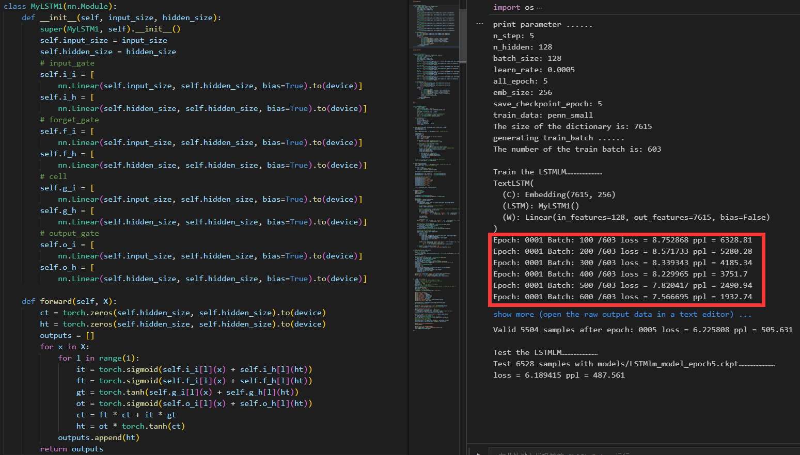
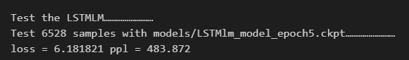

# 实现一个基于LSTM的语言模型

### 亮点

- 支持`cuda`或`cpu`训练
- 支持`单层LSTM`和`任意层LSTM`
- 使用统一配置属性进行配置

### 运行环境

- Windows 10 64位 21H1
- Python 3.8.8 64-bit
- Torch 1.9.0

### 运行方式

打开`LSTMLM.py`文件

文件内有3个配置属性，分别为`dev_first`、`MyLSTM_select`、`MyLSTM_layer`

- `dev_first`配置属性的可用值为`cuda`或`cpu`，用于选择训练设备
- `MyLSTM_select`配置属性的可用值为`'1'`或`'n'`
  当值为`'1'`时，将选用单层模型`MyLSTM1`进行训练
  当值为`'n'`时，将选用多层模型`MyLSTM`进行训练
- `MyLSTM_layer`配置属性的可用值为大于等于`1`的整数，用于设置多层模型的层数
  仅在选择多层模型`MyLSTM_select = 'n'`进行训练时有效。

> 除此之外，代码中任何地方都不需要修改

### 核心类

##### MyLSTM1

> 该类实现了单层LSTM模型

##### 定义

`input_size`：定义输入维度

`hidden_size`：定义隐藏层维度

##### 输入

`X`：输入矩阵

##### 输出

`outputs`：隐藏层矩阵

##### MyLSTM

> 该类实现了多层LSTM模型

##### 定义

`input_size`：定义输入维度

`hidden_size`：定义隐藏层维度

`layer`：定义层数（默认值为1）

##### 输入

`X`：输入矩阵

##### 输出

`outputs`：最后一层的隐藏层矩阵

> 第一层使用输入矩阵作为输入，之后的层以前一层的隐藏层为输入，每一层都有自己独立的隐藏层和系数

##### TextLSTM

> 该类实现了LSTM训练网络

##### 定义

> 无参数

##### 输入

`X`：输入矩阵

##### 输出

`outputs`：全连接层输出

### 其他问题

多层LSTM采用的结构使得模型在刚开始训练时损失较大，但最终结果相差不大

大概是使用了数组定义网络的结构，使得最初的训练损失较大，以下为实验结果

下图为`LSTM1`，最初的损失为6.56，ppl为712。最终的损失为5.7

下图对`LSTM1`做了轻微修改，仅仅在模型中添加了括号，将`nn.Linear()`变成了`[nn.Linear()]`，但最初的损失却变为8.75，ppl为6328。最终的损失为6.1。

以上结果表明，使用这样的数组结构定义网络，会使训练初期的损失变大，但最终结果相差不大，如果增大训练次数，最终结果应该会几乎没有差距，具体原因不明。

